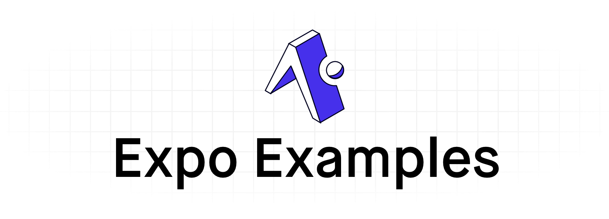

  
  
  
  

  <a aria-label="create a new example" href="https://github.com/expo/examples/blob/master/contributing.md"><b>Create an Example</b></a>
 |
  <a aria-label="suggest an example" href="https://github.com/expo/examples/issues/new?assignees=&labels=&template=feature_request.md">Suggest an Example 🚀</a>

Easy example for using features, libraries, and other integrations with the Expo SDK!

  
  
  

## Contributors ✨

<!-- ALL-CONTRIBUTORS-BADGE:START - Do not remove or modify this section -->

<!-- ALL-CONTRIBUTORS-BADGE:END -->

Thanks goes to these wonderful people ([emoji key](https://allcontributors.org/docs/en/emoji-key)):

<!-- ALL-CONTRIBUTORS-LIST:START - Do not remove or modify this section -->
<!-- prettier-ignore-start -->
<!-- markdownlint-disable -->
<table>
  <tr>
    <td align="center"><a href="https://twitter.com/baconbrix"> <b>Evan Bacon</b></a> <a href="https://github.com/expo/examples/commits?author=EvanBacon" title="Code">💻</a></td>
    <td align="center"><a href="https://github.com/brentvatne"> <b>Brent Vatne</b></a> <a href="https://github.com/expo/examples/commits?author=brentvatne" title="Code">💻</a></td>
    <td align="center"><a href="https://bycedric.com"> <b>Cedric van Putten</b></a> <a href="https://github.com/expo/examples/commits?author=byCedric" title="Code">💻</a></td>
    <td align="center"><a href="https://github.com/cruzach"> <b>Charlie Cruzan</b></a> <a href="https://github.com/expo/examples/commits?author=cruzach" title="Code">💻</a> <a href="https://github.com/expo/examples/commits?author=cruzach" title="Documentation">📖</a></td>
    <td align="center"><a href="https://blog.calebnance.com"> <b>Caleb Nance</b></a> <a href="https://github.com/expo/examples/commits?author=calebnance" title="Code">💻</a> <a href="https://github.com/expo/examples/commits?author=calebnance" title="Documentation">📖</a></td>
  </tr>
</table>

<!-- markdownlint-enable -->
<!-- prettier-ignore-end -->
<!-- ALL-CONTRIBUTORS-LIST:END -->

This project follows the [all-contributors](https://github.com/all-contributors/all-contributors) specification. Contributions of any kind welcome!
