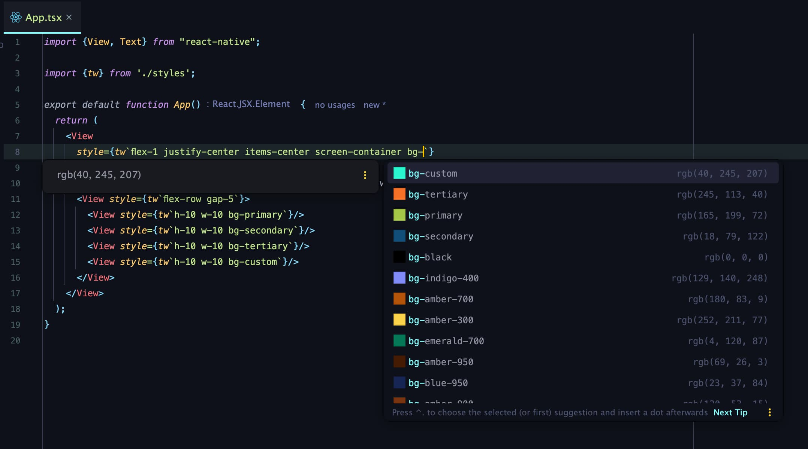

# Expo with Tailwind React Native Classnames

<p>
  <!-- iOS -->
  
  <!-- Android -->
  
  <!-- Web -->
  
</p>

This is a template for Expo projects that uses [Tailwind React Native Classnames](https://github.com/jaredh159/tailwind-react-native-classnames) to style components.

It includes auto-completion for Tailwind CSS classes in VSCode and WebStorm.

[//]: # (Image of the example)


## 🚀 How to use

- Install packages with `yarn` or `npm install`.
  - If you have native iOS code run `npx pod-install`
- Run `yarn start` or `npm run start` to start the bundler.
- Open the project in a React runtime to try it:
  - iOS: [Client iOS](https://itunes.apple.com/app/apple-store/id982107779)
  - Android: [Client Android](https://play.google.com/store/apps/details?id=host.exp.exponent&referrer=blankexample)
  - Web: Any web browser on [localhost or through HTTPS](https://developer.mozilla.org/en-US/docs/Web/Security/Secure_Contexts)

### 📁 File Structure

```
├── .config
│   └── tailwind.config.ts ➡️ Tailwind config file for the VSCode extension and WebStorm plugin
├── .idea
│   └── tailwindcss.xml ➡️ Tailwind CSS plugin settings for WebStorm
├── .vscode
│   ├── extensions.json ➡️ Recommended Tailwind extension
│   └── settings.json ➡️ Recommended settings for the Tailwind extension
├── styles
│   ├── classes.ts ➡️ Tailwind custom classes
│   ├── index.ts ➡️ Tailwind CSS classes
│   ├── tailwind.config.ts ➡️ Tailwind config file
│   └── tailwindTheme.ts ➡️ Tailwind theme
├── app.config.ts ➡️ Expo config file
├── App.tsx ➡️ Entry Point
└── babel.config.js ➡️ Babel config (should be using `babel-preset-expo`)
```

## 📝 Notes

* Learn more about [Tailwind React Native Classnames](https://github.com/jaredh159/tailwind-react-native-classnames)
* Learn more about [Tailwind CSS](https://tailwindcss.com/docs)
* Learn more about [Expo](https://docs.expo.dev/)
